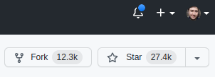
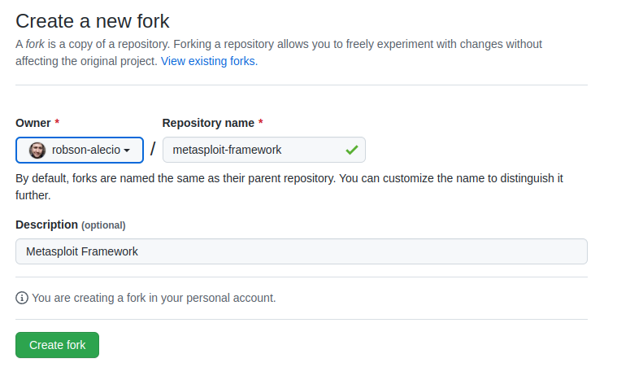
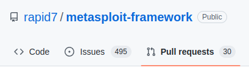
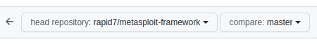

# Trabalho sobre Design Patterns

## Faça um fork do projeto clicando em fork

## Clique em `Create fork`

## Realizando o trabalho

Você deverá clonar o projeto e fazer com que os testes unitários passem.
São 2 Design Patterns: Decorator e State.
Após resolução faça um commit no **seu** repositório 

## Enviando a resposta
Volte no [repositório original](https://github.com/robson-alecio/design-patterns-exam), vá na sessão de **Pull Requests**

Crie um novo Pull Request

Clique no link `compare across forks`

No lado direito escolha o seu repositório e branch e submeta

# Importante

Somente serão aceitos Pull requests criados até dia 12/06/2022.
